# SmartWatchdog 🐕

[](https://github.com/ROZ-MOFUMOFU-ME/smartwatchdog/actions/workflows/lint-format.yml)
[](https://github.com/ROZ-MOFUMOFU-ME/smartwatchdog/actions/workflows/deploy.yml)
[](./coverage/lcov-report/index.html)
[](https://www.typescriptlang.org/)
[](https://nodejs.org/)
[](https://workers.cloudflare.com/)
[](https://opensource.org/licenses/MIT)

> **Googleスプレッドシート**と**Cloudflare Workers**を使用したサーバーレスなサーバー死活監視ツール

## 📋 目次

- [概要](#概要)
- [主な機能](#主な機能)
- [アーキテクチャ](#アーキテクチャ)
- [技術スタック](#技術スタック)
- [セットアップ](#セットアップ)
- [使用方法](#使用方法)
- [開発](#開発)
- [テスト](#テスト)
- [CI/CD](#cicd)
- [トラブルシューティング](#トラブルシューティング)
- [貢献](#貢献)
- [ライセンス](#ライセンス)

## 🎯 概要

SmartWatchdogは、Googleスプレッドシートを管理画面として使用し、Cloudflare Workersでサーバーの死活監視を行うサーバーレスな監視ツールです。通知はDiscord Webhookで行います。

### ✅ 動作確認済み

- **Google Sheets API連携**: サービスアカウント認証による安全なアクセス
- **KVストレージ**: 状態変化の検出と履歴保存
- **Discord通知**: エラー/復旧時の自動通知
- **Cronトリガー**: 10分間隔での自動監視
- **複数シート対応**: 複数のサーバーグループを独立管理

### 🚀 本番運用例

- **監視URL**: `https://your-worker.your-subdomain.workers.dev`
- **実行間隔**: 10分間隔（Cronトリガー）
- **監視対象**: Googleスプレッドシート
- **通知先**: Discord Webhook

### 特徴

- **🔄 自動監視**: 設定した間隔でサーバーの状態を自動チェック
- **📊 スプレッドシート管理**: 直感的なGoogleスプレッドシートでの監視対象管理
- **🔔 Discord通知**: 状態変化をリアルタイムでDiscordに通知
- **🎨 視覚的フィードバック**: スプレッドシートの色分けで状態を一目で確認
- **💾 状態保持**: KVでの状態履歴管理
- **🚀 サーバーレス**: Cloudflare Workersによる自動スケーリング

## ✨ 主な機能

### 1. サーバー監視

- HTTP/HTTPSエンドポイントの死活監視
- TCPポート監視（Cloudflare Sockets API対応）
- カスタマイズ可能なタイムアウト設定（デフォルト: 5秒）
- 詳細なエラー情報の取得

### 2. スプレッドシート連携

- 複数シート対応
- 自動的な状態更新と色分け
- 削除されたサーバーの自動クリーンアップ

### 3. Discord通知

- エラー発生時の即座通知
- 復旧時の通知
- @everyone/@roleメンションや埋め込み通知
- スプレッドシートへの直接リンク

### 4. 状態管理

- KVでの状態履歴保存
- 変更検知による効率的な更新
- 複数シートの独立した状態管理

## 🏗️ アーキテクチャ

```mermaid
graph LR
    A[📊 Google Sheets] -->|監視対象取得| B[☁️ Cloudflare Workers]
    B -->|ヘルスチェック| C[🖥️ 監視対象サーバー]
    B <-->|状態読み書き| D[💾 KV Storage]
    B -->|状態更新| A
    B -->|通知| E[💬 Discord]
    F[⏰ Cron 10分間隔] -->|実行| B
```



### 🔄 データフロー詳細

1. **監視対象取得**: Google Sheetsから監視対象サーバーのリストを取得
2. **サーバー監視**: HTTP/HTTPSリクエストで各サーバーの死活監視
3. **状態管理**: Cloudflare KVで状態履歴を保存・比較
4. **状態更新**: 変化があった場合のみGoogle Sheetsを更新
5. **通知送信**: エラー/復旧時にDiscord Webhookで通知
6. **定期実行**: Cron Triggerで10分間隔で自動実行

## 🛠️ 技術スタック

- **TypeScript**
- **Cloudflare Workers**
- **Google Sheets API**
- **Discord Webhook API**
- **Cloudflare KV**
- **Jest / ESLint / Prettier / GitHub Actions**

## 🚀 セットアップ

### 前提条件

- Node.js 22.x 以上
- npm 9.x 以上
- Google Cloud Platform アカウント
- Discordサーバー管理権限
- Cloudflareアカウント

### 1. リポジトリのクローン

```bash
git clone https://github.com/ROZ-MOFUMOFU-ME/smartwatchdog.git
cd smartwatchdog
npm install
```

### 2. Google Cloud Platform の設定

（Google Sheets APIの有効化・サービスアカウント作成・シート共有は従来通り）

### 3. Discord Webhook の設定

1. Discordサーバーのチャンネル設定→「連携サービス」→「ウェブフック」→「新しいウェブフック」作成
2. Webhook URLをコピー

### 4. Cloudflare Workers/KVの設定

#### 4.1 KV Namespaceの作成

```bash
# KV Namespaceを作成
wrangler kv namespace create STATUS_KV

# 出力されたIDをwrangler.tomlに設定
```

#### 4.2 環境変数の設定

```bash
# シークレット（暗号化）の設定
wrangler secret put GOOGLE_PRIVATE_KEY
wrangler secret put DISCORD_WEBHOOK_URL

# 通常の環境変数はwrangler.tomlに記載
```

#### 4.3 wrangler.toml設定例

```toml
name = "smartwatchdog"
main = "dist/index.js"
compatibility_date = "2025-06-30"
compatibility_flags = ["nodejs_compat"]

[vars]
GOOGLE_CLIENT_EMAIL = "example-service@example-project.iam.gserviceaccount.com"
SPREADSHEET_ID = "1abc123def456ghi789jkl0mn"
RANGE = "A2:D"
DISCORD_MENTION_ROLE_ID = "123456789012345678"

# Cron Trigger (10分間隔)
[triggers]
crons = ["*/10 * * * *"]

# KV Namespace binding
[[kv_namespaces]]
binding = "STATUS_KV"
id = "your-kv-namespace-id-here"

[observability.logs]
enabled = true

[build]
command = "npm run build"
```

### 5. デプロイと動作確認

```bash
# TypeScriptビルド
npm run build

# Cloudflare Workersにデプロイ
wrangler deploy

# 動作確認
curl https://your-worker.your-subdomain.workers.dev

# KVストレージの確認
wrangler kv key list --binding STATUS_KV

# リアルタイムログの確認
wrangler tail
```

#### 5.1 正常動作の確認

- HTTP ステータス 200 でレスポンスが返る
- スプレッドシートのステータス列が自動更新される
- Discord通知が送信される（状態変化時）
- KVにデータが保存される

#### 5.2 本番運用設定

- **自動実行**: Cronトリガーが10分間隔で監視実行
- **手動実行**: Worker URLにアクセスで即座実行
- **監視URL**: `https://your-worker.your-subdomain.workers.dev`

## 📖 使用方法

### 📋 実際の設定例

#### Google スプレッドシート「SmartWatchdog」

| A列（サーバー名） | B列（サーバーURL）     | C列（ステータス） | D列（最終更新）           |
| ----------------- | ---------------------- | ----------------- | ------------------------- |
| Example Server    | https://example.com    | ERROR: Status 404 | 2025-07-01 05:11:59 (JST) |
| Sample API        | https://api.sample.com | OK: Status 200    | 2025-07-01 05:01:32 (JST) |

#### 動作例

```bash
# Worker実行結果
$ curl https://your-worker.your-subdomain.workers.dev
{
  "message": "Server health check complete",
  "results": [
    {
      "row": ["Example Server", "https://example.com", "OK: Status 200", "2025-06-27 13:43:05 (JST)"],
      "rowIndex": 35,
      "statusObj": {
        "status": "ERROR: Status 404",
        "lastUpdate": "2025-07-01 05:11:59 (JST)"
      }
    }
  ]
}
```

上記の例では、Example ServerのステータスがOKからERRORに変化したため、Discord通知が送信され、スプレッドシートが更新されます。

#### 列の説明

- **A列**: サーバー名（任意、空の場合はURLが使用される）
- **B列**: サーバーURL（必須、HTTP/HTTPS）
- **C列**: ステータス（自動更新）
  - `OK: Status 200` - 正常
  - `ERROR: Status 404` - エラー
  - `ERROR: Server not reachable` - 到達不能
- **D列**: 最終更新日時（自動更新）

### 2. 監視の開始

#### 2.1 自動監視

- **Cronトリガー**: 10分間隔で自動実行
- **設定場所**: `wrangler.toml`の`[triggers]`セクション
- **確認方法**: Cloudflareダッシュボードでトリガー状況確認

#### 2.2 手動監視

```bash
# 手動でWorkerを実行
curl https://your-worker.your-subdomain.workers.dev

# パラメータ付きで実行（範囲指定）
curl "https://your-worker.your-subdomain.workers.dev?offset=0&limit=10"
```

#### 2.3 監視状況の確認

```bash
# KVストレージの状態確認
wrangler kv key list --binding STATUS_KV

# リアルタイムログ確認
wrangler tail --format pretty

# 特定のKVキーの内容確認
wrangler kv key get "SPREADSHEET_ID-SHEET_ID" --binding STATUS_KV
```

### 3. 通知とアラートの管理

#### 3.1 Discord通知の種類

- **エラー発生時**:
  - 🚨 赤色embed + `:rotating_light:`
  - ロールメンション（設定されている場合）
  - スプレッドシートへの直接リンク

- **復旧時**:
  - ✅ 緑色embed + `:white_check_mark:`
  - 復旧通知メッセージ

#### 3.2 通知内容

各通知には以下の情報が含まれます：

- **サーバー名**: A列の値（またはURL）
- **サーバーURL**: B列の監視対象URL
- **ステータス**: 現在の状態（OK/ERROR）
- **最終更新日時**: JST形式の日時
- **直接リンク**: スプレッドシートの該当行へのリンク

#### 3.3 ロールメンション設定

```toml
# wrangler.tomlでロールIDを設定
DISCORD_MENTION_ROLE_ID = "123456789012345678"
```

## 🛠️ 開発

### 開発環境のセットアップ

```bash
# 依存関係のインストール
npm install

# TypeScriptのビルド
npm run build

# 開発サーバーの起動（ローカルテスト用）
npm run start:ts
```

### コード品質管理

```bash
# ESLintによる静的解析
npm run lint

# Prettierによる自動整形
npm run format

# 型チェック
npx tsc --noEmit
```

### プロジェクト構造

```
smartwatchdog/
├── src/
│   ├── index.ts              # メインエントリーポイント
│   ├── types.ts              # TypeScript型定義
│   └── utils/                # ユーティリティ関数
│       ├── date.ts           # 日時処理（JST対応）
│       ├── google_jwt.ts     # Google JWT認証
│       ├── sheets_fetch.ts   # Google Sheets API操作
│       └── status.ts         # サーバーステータス処理
├── dist/                     # ビルド成果物
├── coverage/                 # テストカバレッジレポート
├── wrangler.toml            # Cloudflare Workers設定
├── tsconfig.json            # TypeScript設定
├── jest.config.ts           # Jest設定
├── eslint.config.ts         # ESLint設定
└── package.json             # プロジェクト設定
```

## 🧪 テスト

### テストの実行

```bash
# 全テストの実行
npm test

# カバレッジ付きテスト
npm test -- --coverage

# 特定のテストファイル
npm test -- src/utils/status.test.ts
```

### テストカバレッジ

- **ユニットテスト**: 各ユーティリティ関数のテスト
- **統合テスト**: Discord通知、KV操作のテスト
- **モック**: 外部API（Google Sheets/Discord/KV）のモック化

### テストファイル構成

```
src/
├── index.test.ts         # メイン機能のテスト
└── utils/
    ├── date.test.ts      # 日時処理のテスト
    └── status.test.ts    # ステータス処理のテスト
```

## 🔄 CI/CD

- GitHub ActionsでLint/Format/Test自動化
- wrangler publishで自動デプロイも可能

### GitHub Actions ワークフロー

#### 1. Lint/Format/Test (`lint-format.yml`)

- **トリガー**: push/PR to main/dev
- **処理**:
  - ESLintによる静的解析
  - Prettierによるコード整形チェック
  - Jestによるユニットテスト

#### 2. Deploy (`deploy.yml`)

- **トリガー**: push to main/dev
- **処理**:
  - 複数Node.jsバージョンでのテスト
  - Cloudflare Workersへの自動デプロイ

### バッジ

- **Lint/Format**: コード品質の状態
- **Deploy**: デプロイの成功/失敗
- **Coverage**: テストカバレッジ

## 🔧 トラブルシューティング

### よくある問題と解決方法

#### 1. KVストレージが空の場合

```bash
# KVの状態確認
wrangler kv key list --binding STATUS_KV
# 結果: [] （空の配列）
```

**原因と対策**:

- **正常な状態**: 初回実行時やサーバー状態に変化がない場合
- **データ取得確認**: Worker URLにアクセスして手動実行
- **スプレッドシート確認**: B列（URL列）にデータが正しく入力されているか

#### 2. Google Sheets API エラー

```
Error: Failed to fetch sheet metadata: 403 Forbidden
```

**解決方法**:

- サービスアカウントがスプレッドシートに共有されているか確認
- Google Sheets APIが有効化されているか確認
- 秘密鍵の改行文字が正しく設定されているか確認

#### 3. Discord通知が送信されない

**確認項目**:

- Webhook URLが正しく設定されているか
- Discordチャンネルの権限が正しいか
- `wrangler secret list`でシークレットが設定されているか確認

#### 4. Cronトリガーが動作しない

```bash
# Cloudflareダッシュボードでトリガー状況確認
# または wrangler.toml の [triggers] セクション確認
[triggers]
crons = ["*/10 * * * *"]  # 10分間隔
```

#### 5. Worker実行時のタイムアウト

**対策**:

- 大量のサーバーを監視する場合は`offset`と`limit`パラメータを使用
- 例: `?offset=0&limit=20`で20件ずつ処理

### デバッグコマンド

```bash
# リアルタイムログ確認
wrangler tail --format pretty

# KVの全キー確認
wrangler kv key list --binding STATUS_KV

# 特定のKV値確認
wrangler kv key get "KEY_NAME" --binding STATUS_KV

# シークレット一覧確認
wrangler secret list

# Worker手動実行（デバッグ情報付き）
curl -v https://your-worker.your-subdomain.workers.dev
```

## 🤝 貢献

- フォーク＆PR歓迎
- TypeScript/ESLint/Prettier/Jestルール遵守

### 貢献の流れ

1. このリポジトリをフォーク
2. 機能ブランチを作成 (`git checkout -b feature/amazing-feature`)
3. 変更をコミット (`git commit -m 'Add amazing feature'`)
4. ブランチにプッシュ (`git push origin feature/amazing-feature`)
5. プルリクエストを作成

### 開発ガイドライン

- TypeScriptの型安全性を保つ
- テストカバレッジを維持する
- ESLint/Prettierのルールに従う
- コミットメッセージは日本語で記述

### 報告すべき問題

- バグ報告
- 機能要求
- ドキュメント改善
- パフォーマンス改善

## 📄 ライセンス

このプロジェクトは [MIT License](LICENSE) の下で公開されています。

## 🙏 謝辞

- [Google Sheets API](https://developers.google.com/sheets/api) - スプレッドシート操作
- [Cloudflare Workers](https://developers.cloudflare.com/workers/) - サーバーレス実行環境
- [Discord Webhook API](https://discord.com/developers/docs/resources/webhook) - 通知機能
- [TypeScript](https://www.typescriptlang.org/) - 型安全な開発

## 📞 サポート

- **Issues**: [GitHub Issues](https://github.com/ROZ-MOFUMOFU-ME/smartwatchdog/issues)
- **Documentation**: このREADMEファイル
- **Email**: プロジェクトメンテナーまで
